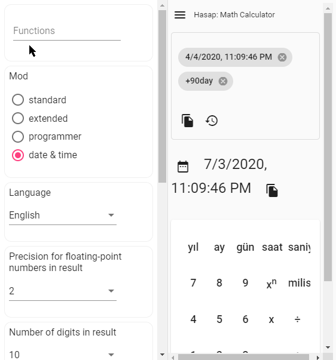
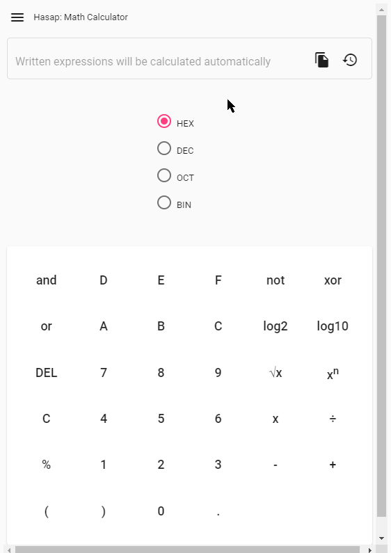
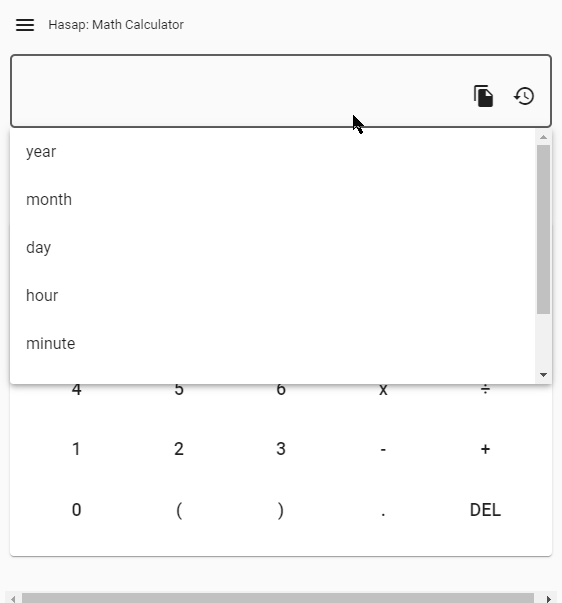
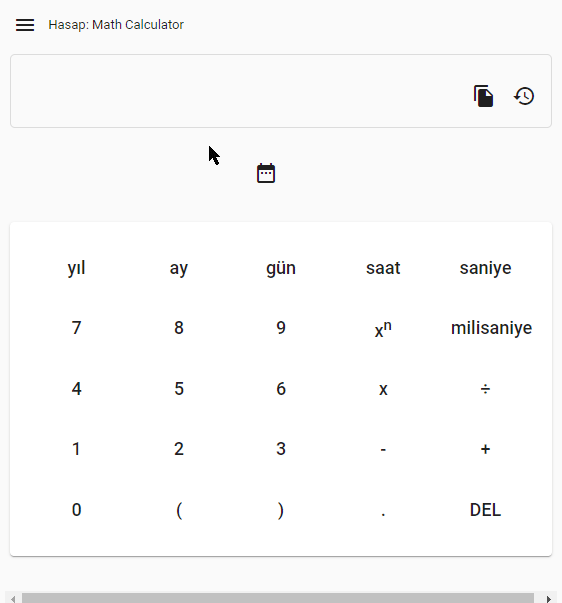
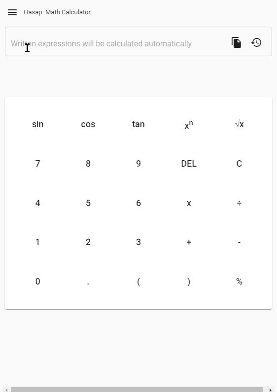
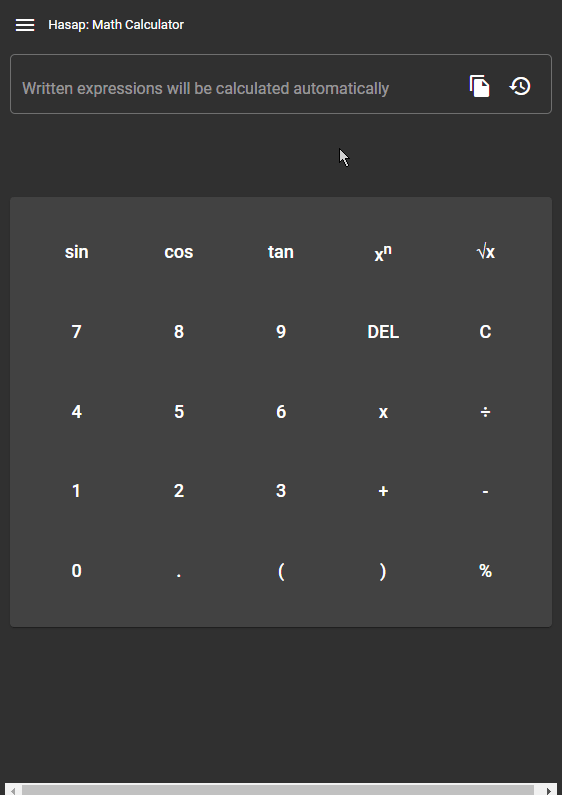
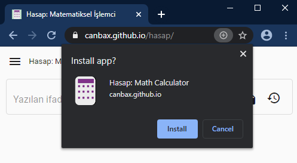
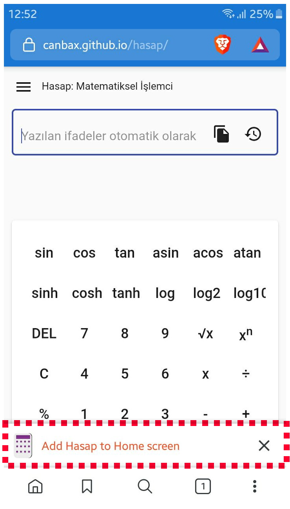
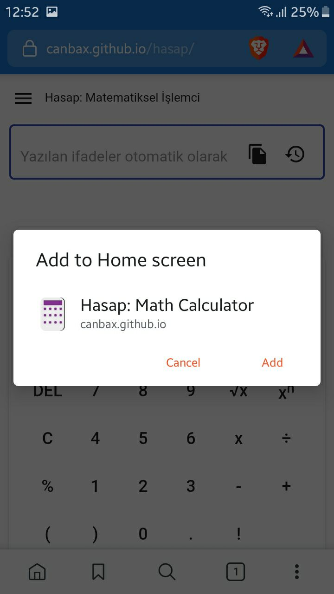
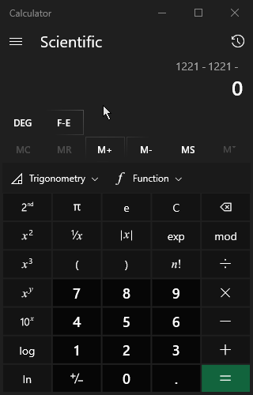

# hasap

A web-based general-purpose math calculator.https://canbax.github.io/hasap/

## features

### wide variaety of functions
This application uses [math.js](https://github.com/josdejong/mathjs) for calculations.[math.js](https://github.com/josdejong/mathjs) has many [functions](https://mathjs.org/docs/reference/functions.html). You can see list of functions from user-interface.

  

### automatic calculations

As you type mathematical expressions, the results are calculated automatically after you stopped typing. You don't need to press any button to calculate.

### 4 different modes

There are 4 different modes. All the modes have their own screen keyboard.

In **programmer** mode you can make calculations in 4 different bases and can see the results in 4 different bases.(hexadecimal, decimal, octal, binary) You can copy the results of calculations in 4 different bases.

  

In **date & time** mode you can make date-time calculations. For example, let's say you want to know how much time it is 13800 seconds minus 10000 milliseconds. You can use autocomplete for selecting time units like in the image below.

  

Here you can also make date-time calculations. Let's say today is 4 of April 2020. What is the date after 90 days. It is 3 of July 2020.

  

### You can change your theme

  

### Copy-paste and others

You can copy-paste input. You can copy the results of the calculations. You can ignore commas in calculations.
You can set the number of digits in the result. You can set the precision in results.

  

## Use it as an app 

Since **Hasap** is a progressive web app, you can download it and use it as an app. If you download it as an app, you can use it without the Internet.

  

I didn't consider mobile experience. So it is not good in mobile but it can be used anyway.

  

  

## Yet another calculator. Why?

I find the tools that I use frustrating and not functional enough.
For example Windows 10 has a great calculator. It has more functionality than this one. I definitely inspired by it.

* But you can not copy paste whole strings to it.
* Let's say I did a long calculation like `2^4-145+4*23` . Why I can't change 145 to 146?
* I really like button pressed effect on screen keyboard. But there is a small glitch which I found bit annoying. When I press a button continiously It is not shown pressed contiously, there is a small glitch.

  

I used google as calculator a lot. You can copy-paste text and change the string from the middle of it. But When I changed angle unit to degree why the results aren't changing.

  

I also used duckduckgo a lot. It wasn't good with trigonometric functions either.

  

## For developers
Built with [Angular CLI](https://github.com/angular/angular-cli) version 9.0.7.
Use `npm i` to install dependencies. `ng s` to run in development mode. 
I also use `angular-cli-ghpages` for deploying my app to github-pages branch using the command `ng deploy --base-href=/hasap/`. Thanks for this awesome library as well.

I hope this tool would be handy and useful for people.

